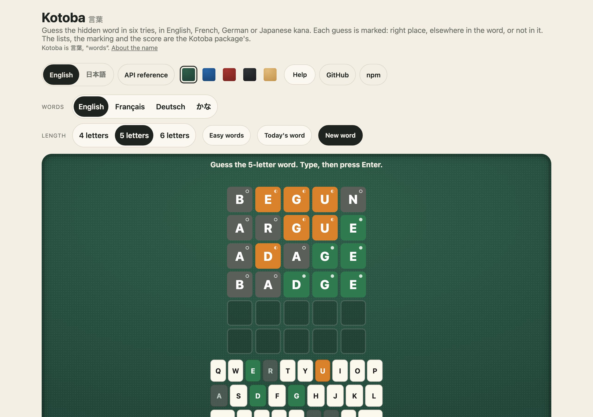
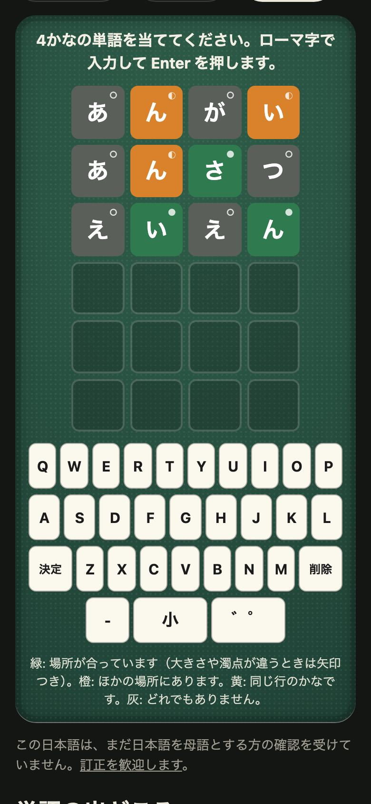

<h1 align="center">Kotoba <sub>言葉</sub></h1>

<p align="center"><strong>Word lists and word-game rules for JavaScript and TypeScript.</strong><br>
English, French, German and Japanese (kana) dictionaries for five-letter and other word games, each list its own import so a page loads only what it plays; with guess marking, scoring, kana marks, romaji input and keyboard rows; a word of the day; a ready-made word game for any page; and a command line. No dependencies.</p>

<p align="center">
  <a href="https://github.com/johnmorrisdotca/kotoba/actions/workflows/ci.yml"></a>
  <a href="https://www.npmjs.com/package/@johnmorrisdotca/kotoba"></a>
  <a href="./NOTICE.md"></a>
  
</p>

<p align="center"><a href="https://johnmorrisdotca.github.io/kotoba/"><strong>Play a word game →</strong></a> · <a href="https://johnmorrisdotca.github.io/kotoba/api.html">API reference</a></p>

<p align="center">
  
  
</p>

## In 30 seconds

```sh
npm install @johnmorrisdotca/kotoba
```

```ts
import { markGuess, readWordLists } from "@johnmorrisdotca/kotoba";

// Load only the list you play: each list is an entry point of its own.
const { EN_WORDS } = await import("@johnmorrisdotca/kotoba/words-en");
const five = readWordLists(EN_WORDS, 5)!;

five.allowed.has("crane");          // true: a word that may be guessed
five.answers.length;                // the words that may be hidden
markGuess("crane", "react");        // ["near", "near", "hit", "miss", "near"]
```

Or put the whole game on a page:

```ts
import { mountKotoba } from "@johnmorrisdotca/kotoba/play";

mountKotoba(document.getElementById("game")!, { words: "en", size: 5, daily: true });   // today's word, the same for everybody
```

Or from a terminal, with nothing to install:

```sh
npx @johnmorrisdotca/kotoba check crane
```

## Who it is for

- **Word-game makers**: a five-letter game in English, French, German or
  Japanese, with lists already cleaned of names, brands, slurs and subtitle
  noise, the marking rule every such game shares, a word of the day, and a
  ready-made board if you want one.
- **Anyone needing a sound list of common words** by length, with an easy tier
  inside the answers inside the words that may be guessed.
- **Teachers and people who like to check**: the command line looks a word up,
  lists a list, marks a guess and gives the word of the day.

## Use it in your project

Kotoba has two halves: the rules and lists, which are plain functions over plain
data and work anywhere, and a board, `mountKotoba`, which draws a game into one
element of a page. The recipes below are the board; the first is the rules alone.

### 1. The rules and lists alone

```ts
import { dailyWord, markGuess, readWordLists, startWordGame, submitWordGame, typeWordGame } from "@johnmorrisdotca/kotoba";

const { EN_WORDS } = await import("@johnmorrisdotca/kotoba/words-en");
const five = readWordLists(EN_WORDS, 5)!;

dailyWord(five.answers, "2026-10-01", { salt: "en-5-answers" });   // "elect": the same on every machine, for everybody

let round = startWordGame("en", 5, "crane");          // a round is plain data
for (const key of "react") round = typeWordGame(round, key);
const sent = submitWordGame(round, five);             // the guess is checked against the list
round = sent.game;
sent.refused;                                         // null: a word of the list is taken
round.guesses;                                        // ["react"]
```

### 2. A game on a plain page

```html
<div id="game"></div>
<script type="module">
  import { mountKotoba } from "./node_modules/@johnmorrisdotca/kotoba/dist/play.js";

  const play = mountKotoba(document.getElementById("game"), { words: "fr", size: 5 });
  await play.ready;                       // the list is fetched, and the round dealt
</script>
```

No bundler is needed: the board and the lists are ES modules that import nothing
outside the package, and each list is fetched only when it is played.

### 3. React

```tsx
import { mountKotoba } from "@johnmorrisdotca/kotoba/play";
import { useEffect, useRef } from "react";

export function WordGame({ words = "en" }: { words?: "en" | "fr" | "de" | "ja" }) {
  const holder = useRef<HTMLDivElement>(null);
  useEffect(() => {
    const play = mountKotoba(holder.current!, { words });
    return () => play.destroy();
  }, [words]);
  return <div ref={holder} />;
}
```

### 4. Vue

```vue
<script setup lang="ts">
import { mountKotoba } from "@johnmorrisdotca/kotoba/play";
import { onBeforeUnmount, onMounted, ref } from "vue";

const holder = ref<HTMLElement>();
let play: ReturnType<typeof mountKotoba> | undefined;
onMounted(() => (play = mountKotoba(holder.value!, { words: "de" })));
onBeforeUnmount(() => play?.destroy());
</script>

<template><div ref="holder" /></template>
```

### 5. Svelte and Angular

The same two calls anywhere there is an element and a place to clean up:
`mountKotoba(element, options)` when the component is shown, and `play.destroy()`
when it goes (`onMount` and its returned function in Svelte; `ngAfterViewInit`
and `ngOnDestroy` in Angular).

### 6. A word list in a script or on a server

```ts
import { loadWordList } from "@johnmorrisdotca/kotoba/load";

const kana = await loadWordList("ja", 4);   // { easy, answers, allowed, release }, or null for a size there is no list of
```

`loadWordList` reads one list by language and size and fetches nothing else. The
command line is built on it.

### What a developer gets

- The marking, the scores, the keyboard rows, kana marks and romaji input as
  plain functions, tested.
- A round of a word game as plain data, so it can be kept in any framework's
  state, replayed from its guesses or played by a program.
- A board with the keyboard of each language, the legend of the marks and
  accessible labels, themed by CSS variables.
- Lists that are machine output from real dictionaries, each its own file.
- A word of the day with no state and no clock to keep.

## Features

- **Four dictionaries, cleaned.** English, French, German and Japanese kana,
  each a real dictionary's words with names, brands, slurs and subtitle noise
  left out, in an easy tier inside the answers inside the words that may be
  guessed.
- **Each list its own import**, so a page loads only the language and length it
  plays.
- **Guess marking** that counts a letter only as often as the word holds it, and
  kana marks where a voiced or small kana counts as its family.
- **Scoring** for a solved or lost game: letters placed, rows to spare, speed.
- **A round as plain data** (`game.ts`): typing, erasing, sending a guess,
  romaji into kana, the size and mark of a kana, and the score.
- **A word of the day** (`dailyWord`), the same for everybody, every word once
  before any comes round again.
- **A board you can put on a page** (`/play`), with the keyboards of English,
  French (AZERTY), German (QWERTZ, with ä ö ü) and kana typed in romaji; marks that never rely on colour alone; and CSS variables to theme it.
- **A command line**: look a word up, list a list, mark a guess, give the word
  of the day.
- **English and Japanese words** for the game and the command line.

## The lists

Each list is its own entry point, so a bundler splits it into its own file and
a page fetches only the language and length it plays. English, French and German
come in four, five and six letters; Japanese in three, four and five kana. In
each, the easy answers are inside the answers, which are inside every word that
may be guessed.

| Entry point | Export | What it holds |
| --- | --- | --- |
| `@johnmorrisdotca/kotoba/words-en` | `EN_WORDS` | English, by length: easy answers, answers, and every word that may be guessed |
| `@johnmorrisdotca/kotoba/words-fr` | `FR_WORDS` | French, the same shape |
| `@johnmorrisdotca/kotoba/words-de` | `DE_WORDS` | German, the same shape, with Ä, Ö and Ü |
| `@johnmorrisdotca/kotoba/pop-answers` | `POP_ANSWERS`, `POP_CATEGORIES` | Pop-culture answers, each with its category as a clue |
| `@johnmorrisdotca/kotoba/pop-guesses` | `POP_GUESSES` | Dictionary guesses at three and seven letters for the pop list |
| `@johnmorrisdotca/kotoba/kana-3`, `/kana-4`, `/kana-5` | `JA_WORDS_3`, `JA_WORDS_4`, `JA_WORDS_5` | Japanese words of three, four and five kana, packed; read with `unpack` |

`readWordLists(data, size)` reads one length of an alphabet list; `unpack(packed,
size)` reads a kana list; `loadWordList(language, size)` (`/load`) does either by
name. How many words each holds, as `kotoba lists` prints it (and a test holds to
the lists):

| List | Size | Easy | Answers | Allowed |
| --- | --- | --- | --- | --- |
| English | 4 | 786 | 1463 | 3168 |
| English | 5 | 880 | 2036 | 6421 |
| English | 6 | 1043 | 2965 | 10742 |
| Français | 4 | 307 | 613 | 1731 |
| Français | 5 | 660 | 1319 | 4489 |
| Français | 6 | 905 | 1810 | 8773 |
| Deutsch | 4 | 339 | 677 | 1976 |
| Deutsch | 5 | 570 | 1139 | 5032 |
| Deutsch | 6 | 851 | 1702 | 10608 |
| かな | 3 | 900 | 2000 | 16444 |
| かな | 4 | 900 | 2000 | 39046 |
| かな | 5 | 900 | 2000 | 35419 |

## The rules

| Export | What it does |
| --- | --- |
| `markGuess(guess, hidden)` | Each letter `hit`, `near` or `miss`, counting a letter only as often as the word holds it |
| `encodeHidden`, `decodeHidden`, `decodeGuesses`, `ALPHABETS` | A hidden word and guesses written down and read back, checked against the language's alphabet |
| `readWordLists`, `unpack`, `KANA_SIZES` | Reading the lists |
| `WORD_SCORE` and the scoring functions | Points for a solved game: letters placed, rows to spare, speed |
| Keyboard rows | The on-screen keyboard's rows for each language |
| `markKanaGuess`, `kanaBase`, `kanaFamily`, `kanaTone`, `kanaFound`, `toggleSize`, `cycleMark`, … | Marking a kana guess, where a kana's voiced and small forms count as its family |
| `readRomaji`, `finishRomaji` | Typing kana with a Latin keyboard |
| Kana scoring | Points for a solved kana game |

## A round

`startWordGame(language, size, hidden)` makes a round; every other function takes a
round and returns a new one, leaving the one it was given alone. Kana are typed in
romaji, which `readRomaji` turns into kana as it can.

| Function | What it does |
| --- | --- |
| `startWordGame(language, size, hidden, rows?)` | A new round: nothing guessed, nothing typed; six guesses unless said |
| `typeWordGame(round, key, now?)` | One key typed; the first key starts the clock |
| `eraseWordGame(round)` | The last thing typed taken back: romaji not yet a kana first |
| `changeWordGame(round, "size" \| "mark")` | The last kana made small or large, or given its next mark |
| `submitWordGame(round, words, now?)` | The guess sent in: the round after it, and `refused` (`"too-short"` or `"not-a-word"`) if it was not taken |
| `guessMarks(round, guess)`, `keyMarks(round)` | How each place of a guess did, and the best mark each letter has earned |
| `wordGameKeys(language)` | The characters a round takes as keys |

A round ends when the guess is the hidden word (`status: "won"`) or the guesses
run out (`"lost"`), and is then scored.

## A word a day

```ts
import { dailyWord, dayKey } from "@johnmorrisdotca/kotoba";

dailyWord(five.answers, "2026-10-01", { salt: "en-5-answers" });   // "elect"
dailyWord(five.answers, new Date(), { zone: "Asia/Tokyo", salt: "en-5-answers" });   // today's word at Tokyo's midnight
dayKey(new Date("2026-10-01T23:30:00Z"), "Asia/Tokyo");            // "2026-10-02"
```

The words are dealt like a shuffled pack the length of the list: every word comes
up once before any comes up again, in an order a hash of the `salt`, the length
and the cycle decides, so the day alone picks the word and no state or clock is
kept. The `salt` names the list: the command line and the board use
`<language>-<size>-<easy|answers>`, so all three agree. A day is a calendar date,
in UTC unless a time zone is named.

**What the word depends on.** The list. The day maps to a place in a pack made
from the list's length and order, so a list that gains or loses a word, or is
made again in another order, deals another pack and the day maps to another word.
The English, French and German lists do not change within a version. The kana
lists are made again from JMdict's newest release every month, so a daily kana
word changes with them: pin the version, or keep your own copy, for a word that
stays put.

## Play it on a page

`mountKotoba(element, options)` draws a board of guesses, the keyboard of the
language under it and the legend of the marks into one element, and plays by touch
or by the device's keyboard. It is the rules above with a face on them. Setting up
(which language, how long, easy words) is yours: call `play.newGame({ … })`.

```ts
const play = mountKotoba(element, { words: "ja", size: 4, locale: "ja", onFinish: (round) => save(round.score) });
await play.ready;        // the list is fetched, and the round dealt
play.game;               // the round, as plain data, or null while a list loads
await play.newGame({ words: "fr", size: 5, easy: true });
play.setLocale("en");    // the game's own words, at once
play.destroy();          // off the page, and the keyboard let go
```

| Option | What it is | Unless said |
| --- | --- | --- |
| `words` | the list: `en`, `fr`, `de` or `ja` | `en` |
| `size` | letters, or kana, in the word | 5, or 4 for `ja` |
| `easy` | hide only one of the easy answers | `false` |
| `rows` | how many guesses the round gives | 6 |
| `seed` | the same seed picks the same word from the same list | one is drawn |
| `daily` | the word of the day: `true` for today in UTC, or a day `YYYY-MM-DD` | |
| `hidden` | the word to find, whatever the lists say | |
| `locale` | the language of the game's own words: `en` or `ja` | `en` |
| `strings` | words of your own, over the locale's: any name of `KOTOBA_STRINGS` | |
| `theme` | CSS variables set on the game | |
| `keyboard` | take the device's keyboard as the keys on the screen | `true` |
| `onFinish` | called once when a round ends, with the round | |
| `onChange` | called after every change, and with null while a list loads | |
| `load` | where a list comes from | `loadWordList` |
| `now` | the time in milliseconds, for the clock a score reads | `Date.now` |

The board is plain elements with `kt-` classes and one `<style id="kotoba-play-style">`
it adds to the page, so its colours and size are CSS variables. A mark is never
told by colour alone: each carries a shape (● right place, ◐ elsewhere, ≈ the same
row of the kana table, ○ not in the word) and an arrow when a kana's size (↓) or
mark (↑) is wrong, and every place has an accessible label that says the same.
The keys never take the focus, so the device's keyboard still types and Enter
still sends.

## The command line

```sh
npm install -g @johnmorrisdotca/kotoba    # then `kotoba`, or use npx with nothing installed
```

```
Usage: kotoba <command> [options]

Word lists and the rules of word games: English, French, German and Japanese kana.

  kotoba check crane                    is it a word, and may it be the hidden one?
  kotoba check さくら                   the same for a word in kana
  kotoba list --words fr --size 5       the words of a list, one to a line
  kotoba list --size 5 --tier easy      only the easy answers
  kotoba mark crane react               mark a guess against the hidden word
  kotoba daily --words en --size 5      the word of the day, the same for everybody
  kotoba lists                          every list, and how many words it holds

Options:
      --words <en|fr|de|ja>    the list: English, French, German or Japanese kana (en unless said)
      --size <n>               letters or kana in a word: 4 to 6, or 3 to 5 for ja (5, or 4 for ja, unless said)
      --tier <easy|answers|allowed>
                               list, daily: which words: the easy answers, every answer, or every word
                               that may be guessed (answers unless said; daily takes easy or answers)
      --date <YYYY-MM-DD>      daily: the day (today, in UTC, unless said)
      --zone <zone>            daily: today by an IANA time zone's midnight
  -j, --json                   print JSON (format 1)
      --lang <en|ja>           English or Japanese (default: your system's)
  -h, --help                   this help
  -v, --version                the version

check reads the list from the word itself (kana make it ja) and the size from its length.
Exit codes: 0 done, 1 what was asked for is not so or could not be done (a word that is not in
the list), 2 the command was wrong.
```

```sh
$ kotoba check crane
crane  English, 5 letters
  may be guessed: yes
  may be the hidden word: yes
  an easy word: no
$ kotoba mark crane react
c r a n e
◐ ◐ ● ○ ◐
● right place, ◐ elsewhere in the word, ○ not in the word
$ kotoba daily --words en --size 5 --date 2026-10-01
2026-10-01  elect
```

The language follows `--lang`, then `LC_ALL`, `LC_MESSAGES` and `LANG`, then the
system's. The command line is run as a child process on Linux, macOS and Windows
in CI. From code it is one function, `runCli` (`@johnmorrisdotca/kotoba/cli`),
which takes the arguments and gives back what to print and the exit code. The
Pop list is a library list only: the command line has the four dictionaries.

## The words of a game

The words a board and the command line say are English and Japanese:
`KOTOBA_STRINGS.en` and `KOTOBA_STRINGS.ja`, one table, so the two are kept side
by side. `kotobaSay` fills in the braces (`{n}`, `{word}`), and `kotobaLanguage`
reads a tag such as `ja_JP.UTF-8`. Any other language is a table of your own with
the same names, passed as `strings`.

## API

The [API reference](https://johnmorrisdotca.github.io/kotoba/api.html) (also kept in the repository as [`docs/api.md`](https://github.com/johnmorrisdotca/kotoba/blob/main/docs/api.md)) lists every export of every entry point, each word list included, with its signature and its doc comment. It is made from the source by `pnpm docs:api`, and a test fails when it falls behind the code.

| Entry point | What it holds |
| --- | --- |
| `@johnmorrisdotca/kotoba` | The rules: marking, scoring, keyboard rows, kana marks, romaji, the round (`game`), the word of the day, the words, and readers for the lists. `VERSION` |
| `@johnmorrisdotca/kotoba/play` | `mountKotoba`, `KOTOBA_PLAY_CSS`, `KOTOBA_PLAY_VARIABLES` |
| `@johnmorrisdotca/kotoba/load` | `loadWordList`, `WORD_LIST_NAMES`, `WORD_LIST_SIZES` |
| `@johnmorrisdotca/kotoba/cli` | `runCli`, `cliLanguage` |
| The lists | see [The lists](#the-lists) |

## Theming

Every colour of the board is a CSS variable on `.kt-root`. Set them in your
stylesheet, on the game's element or any ancestor, or pass them as `theme`, which
sets them on the game itself.

| Variable | What it sets | Value |
| --- | --- | --- |
| `--kt-board` | The board behind the guesses and the keys | `#2f5d4a` |
| `--kt-ink` | Text on the board | `#f3efe4` |
| `--kt-cell` | A cell, and a key | `#fbf8ee` |
| `--kt-cell-ink` | The letter on a cell or a key | `#1b1b1b` |
| `--kt-hit` | A letter in its place | `#2f7a4f` |
| `--kt-near` | A letter elsewhere in the word | `#d9822b` |
| `--kt-kin` | A kana of the same row of the kana table | `#d9b83b` |
| `--kt-miss` | A letter not in the word | `#5a5f5a` |
| `--kt-typed` | The edge of a cell being typed in | `#e0b43b` |
| `--kt-radius` | The board's corners | `14px` |
| `--kt-cell-size` | The side a cell grows to | `60px` |

The board looks the same in light and in dark: it carries its own background.
To sit on a page's own background, set `--kt-board` to `transparent` and `--kt-ink`
to the page's text colour:

```js
mountKotoba(element, { theme: { "--kt-board": "transparent", "--kt-ink": "#222", "--kt-hit": "#1a7f37" } });
```

## Limits

| Limit | Value | Constant |
| --- | --- | --- |
| Lengths of English, French and German words | 4, 5 or 6 letters | `WORD_LIST_SIZES` |
| Lengths of Japanese words | 3, 4 or 5 kana | `KANA_SIZES` |
| Guesses in a round | 6 unless `rows` says | `WORD_GAME_ROWS` |
| Days a daily word is dealt | every calendar day from 0000-01-01 to 9999-12-31 | |
| The word of a day and the list | one pack the length of the list; a changed list is another pack | |
| The kana lists | made again from JMdict every month | |

## Browser and runtime support

The lists, the marking, the rules of a round, the word of the day, the words and
the command line run anywhere JavaScript does: every current browser, Node, Deno
and Bun. They need ES2020, and dynamic `import()` for the lists. The board needs a
DOM and is tested in Chromium and in WebKit, Safari's engine, at phone size with
touch and on a desktop. The package declares Node 22 and later (`engines`), and CI
runs it on Node 22 and 24 and, for the packed package and the command line, on
Linux, macOS and Windows. A time zone other than UTC for a day uses
`Intl.DateTimeFormat`.

## Languages

Two things here have a language, and they are chosen apart. **The words** are
English, French, German and Japanese kana: the `words` option, or `--words`.
**The game's own words** (its prompts, the keys and the legend of the marks, and
the command line's) are English or Japanese: `locale`, or `--lang`. A French game
can be played with Japanese prompts.

**Japanese: included; not yet reviewed by a native reader. Corrections
welcome.** Every Japanese string is listed beside its English in
[docs/strings-ja.md](./docs/strings-ja.md), and there is an
[issue template](https://github.com/johnmorrisdotca/kotoba/issues/new?template=fix-a-translation.md)
for fixing one. A new language for the words is another matter: it needs a real
dictionary of that language whose licence lets its words be shipped, and a
[suggestion](https://github.com/johnmorrisdotca/kotoba/issues/new?template=suggest-a-word-list.md)
is the place to start.

## Architecture

The marking rules, the scores, the keyboards and the rules of a round are plain
functions with no DOM and no dependency. Each word list is an entry point of its
own, so a page loads only the list it plays, and `lists.ts` reads one once it is
loaded. The Japanese side (`kana/`) has the same shape as the English: marks, a
score, and a way to type kana from a keyboard with no Japanese input. The board
(`play.ts`) and the command line (`cli.ts`) are two faces on the same rules and
the same loader (`load.ts`).

```text
src/
├── index.ts         the main entry: the marking rules, scoring, keyboards, kana helpers, a round, the word of the day, the words and a reader for the lists
├── cli.ts           the command line, as a function of its arguments
├── daily.ts         a word a day: days as dates, and a pack of the list dealt by day
├── game.ts          a round of a word game, as plain data: typing, guesses, marks and the score
├── keyboardRows.ts  the physical keyboard drawn under a grid, by language: QWERTY, AZERTY and QWERTZ
├── lists.ts         reading a word list once it is loaded; each list is its own entry point
├── load.ts          loading a list by its language and size, each as a module of its own
├── marks.ts         marking a guess: the rule every five-letter word game shares
├── play.ts          the board you can put on a page, and its stylesheet
├── strings.ts       every word Kotoba says, in English and Japanese
├── version.ts       the package's version
├── wordScore.ts     what a word scores, won or lost
├── kana/  the Japanese side of the games
│   ├── kanaMarks.ts  how a kana guess is coloured, including a kana of the wrong size or mark
│   ├── kanaScore.ts  what a kana word scores, on the same scale as English
│   └── romaji.ts     romaji typed into kana, with no input-method library
└── lists/  the word lists, each its own entry point so a page loads only what it plays
    ├── kana-3.data.ts       the three-kana words
    ├── kana-4.data.ts       the four-kana words
    ├── kana-5.data.ts       the five-kana words
    ├── pop-answers.data.ts  the pop-culture answers
    ├── pop-guesses.data.ts  the pop-culture guesses accepted at three and seven letters
    ├── words-de.data.ts     the German words
    ├── words-en.data.ts     the English words
    └── words-fr.data.ts     the French words
```

Tests sit beside the code they test (`*.test.ts`), `src/wordLists.coverage.test.ts`
holds the lists to their rules, and `src/docs.test.js` holds this README's
examples and tables to the code. `bin/` is the command line's few lines. `scripts/`
builds the lists from their sources, checks the package as npm packs it
(`pnpm test:package`), runs the command line as a child process (`pnpm test:cli`),
makes the API reference, `docs/api.md`, and builds the demo (`pnpm site`) and
tests it in a real browser (`pnpm test:demo`); `demo/` is the page published on
GitHub Pages.

## The name

*Kotoba* is 言葉 (ことば), "words" in Japanese.

## Where the words come from, and their licences

The code is MIT. The lists are data under their sources' terms, set out in full in
[NOTICE.md](./NOTICE.md) (shipped in the package) and at the top of each list file:

- **English**: SCOWL 2020.12.07 (http://wordlist.aspell.net/), under its
  permissive notice.
- **French**: Lexique 3.83, ranked by hermitdave's FrequencyWords, checked
  against Wiktionary: CC BY-SA 4.0.
- **German**: LanguageTool's german-pos-dict, ranked the same way, checked
  against Wiktionary: CC BY-SA 4.0.
- **Japanese**: JMdict, the property of the Electronic Dictionary Research and
  Development Group: CC BY-SA 4.0 and the Group's conditions. Refreshed from
  JMdict's newest release every month (`.github/workflows/jmdict-refresh.yml`).

A word is a word only if a real dictionary of the language says so; a frequency
count only ranks. The lists are made by the scripts in `scripts/`, never by hand.
A project that uses a French, German or Japanese list passes on its share-alike
terms for that list: see [NOTICE.md](./NOTICE.md).

## Where it is used

Kotoba holds the dictionaries of Gomoji, the five-letter word puzzle of
[itsutsu.com](https://itsutsu.com), in English, French, German, pop culture and
kana. Using it somewhere? [Tell us](https://github.com/johnmorrisdotca/kotoba/issues/new?template=add-my-project.md).

### The family

The code of every package is MIT, and all of them were written for the same site. Each is at
[github.com/johnmorrisdotca](https://github.com/johnmorrisdotca):

- [Korokoro](https://github.com/johnmorrisdotca/korokoro) (コロコロ): dice, with exact odds, the dice of 44 games and real sounds.
- [Kyuubu](https://github.com/johnmorrisdotca/kyuubu) (キューブ): a turning cube for the browser, 2×2 to 7×7, with record solves to replay.
- [Hitotsu](https://github.com/johnmorrisdotca/hitotsu) (一つ): a colour-card shedding game for two to eight, with the house rules people play.
- [Toranpu](https://github.com/johnmorrisdotca/toranpu) (トランプ): a deck of playing cards, ten card games with computer players, and three solitaires.
- [Tane](https://github.com/johnmorrisdotca/tane) (種): seeded random numbers and daily seeds, the same in every browser and on every server.
- [Narabe](https://github.com/johnmorrisdotca/narabe) (並べ): one rules engine for abstract board games: gomoku, renju, Reversi, Hex, Go, checkers and more.
- [Tenka](https://github.com/johnmorrisdotca/tenka) (天下): world conquest for two to six, on a map of the real world.
- [Kumimoji](https://github.com/johnmorrisdotca/kumimoji) (組み文字): the crossword tile race, in English and Japanese kana.
- [Tsunagi](https://github.com/johnmorrisdotca/tsunagi) (繋ぎ): a line-joining logic puzzle with 1,792 levels, each with exactly one answer.
- [Jarajara](https://github.com/johnmorrisdotca/jarajara) (ジャラジャラ): mahjong tiles drawn as SVG, stacked layouts, and the matching solitaire Awase.
- [Suido](https://github.com/johnmorrisdotca/suido) (水道): a pipe puzzle: turn the pieces until the water reaches every drain.
- [Domino](https://github.com/johnmorrisdotca/domino) (ドミノ): dominoes and Mexican Train, with a computer player and saved games.
- [Sugoroku](https://github.com/johnmorrisdotca/sugoroku) (双六): backgammon and its variants, with the doubling cube and match play.
- [Kazu](https://github.com/johnmorrisdotca/kazu) (数): grid number puzzles: Sudoku and its variants, Futoshiki and Skyscrapers.
- [Meikyuu](https://github.com/johnmorrisdotca/meikyuu) (迷宮): a maze game of a thousand levels.

## Roadmap

- The game modes of Gomoji (head start, twins, four at once, backwards, the
  dodger) as rules here, beside the marking
- More languages, each from a real dictionary of that language
- A web component for the board, and a React hook
- The Pop list on the command line

## Contributing

See [CONTRIBUTING.md](./CONTRIBUTING.md). In short:

```sh
pnpm install
pnpm check         # lint, types and tests (including the checks on the lists' words)
pnpm test:cli      # the command line, run as a child process
pnpm test:package  # pack it as npm does, install it, import every entry and run the command
pnpm test:demo     # the demo in real browsers, by taps
```

The lists are machine output: change a script in `scripts/` and run it again,
never edit a list by hand. Please follow the [code of conduct](./CODE_OF_CONDUCT.md).

## Changes

See [CHANGELOG.md](./CHANGELOG.md).

## Licence

The code is [MIT](./LICENSE) © John Morris. The word lists are other people's work,
under their own terms: SCOWL's permissive notice for English, and Creative Commons
Attribution-ShareAlike 4.0 for French, German and Japanese. [NOTICE.md](./NOTICE.md)
says which list is which and what that asks of a project that uses it.
